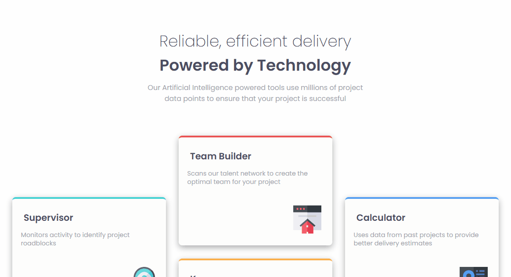
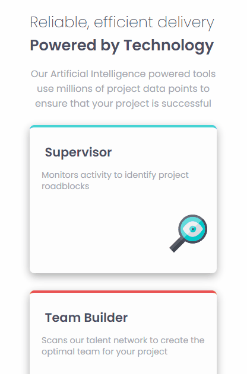

# Frontend Mentor - Four card feature section solution

Esta é uma solução para o [Desafio da seção de quatro recursos de cartão no Frontend Mentor](https://www.frontendmentor.io/challenges/recipe-page-KiTsR8QQKm). Os desafios do Frontend Mentor ajudam você a melhorar suas habilidades de codificação construindo projetos realistas.


### Screenshot

[]

[]


### Link


- URL do site ativo: [link aqui](https://andersonf-dev.github.io/social-proof-section-master/)


### Criado com

- Marcação HTML5 semântica
- Propriedades personalizadas CSS
- grid-template-areas
- Flexbox


### O que aprendi

Foi um bom projeto para treinar grid-template-areas

```css
.header-section{grid-area: header-section;}
.card-conteiner{grid-area: card-conteiner;}

.grid-container {
    display: grid;
    grid-template-areas: "header-section"
                "card-conteiner card-conteiner card-conteiner";

    display: flex;

}

```

### Desenvolvimento contínuo

Este é apenas o decimo primeiro de muitos dos projetos de front end que fiz. Continuarei fazendo e me desenvolvendo ainda mais. Estou aprendendo cada dia mais, fazendo esses desafios, 
